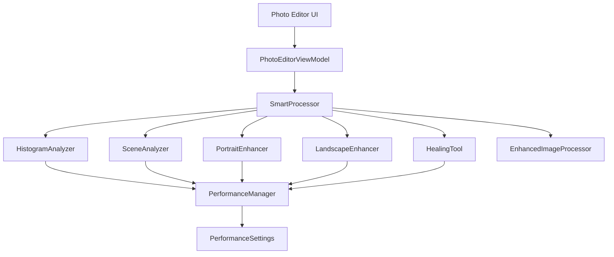

# Design Document

## Overview

The Smart Photo Enhancement feature extends Photara's existing image processing capabilities with intelligent algorithmic analysis and automated adjustments. This system builds upon the current `EnhancedImageProcessor` architecture to provide one-tap enhancements, scene-aware processing, and advanced healing tools while maintaining the app's commitment to on-device processing and user privacy.

The design leverages computer vision algorithms, histogram analysis, and heuristic-based processing to deliver professional-quality results without requiring external APIs or machine learning models.

## Architecture

### High-Level Architecture



### Component Integration

The smart enhancement system integrates with existing components:
- **EnhancedImageProcessor**: Extended with new algorithmic capabilities
- **PhotoEditorViewModel**: Enhanced with smart processing workflows
- **AdjustmentParameters**: Extended with scene-specific parameter sets
- **BitmapCache**: Utilized for intermediate processing results

## Components and Interfaces

### 1. SmartProcessor Interface

```kotlin
interface SmartProcessor {
    suspend fun analyzeScene(bitmap: Bitmap): SceneAnalysis
    suspend fun smartEnhance(bitmap: Bitmap, mode: ProcessingMode): Result<EnhancementResult>
    suspend fun enhancePortrait(bitmap: Bitmap, intensity: Float, mode: ProcessingMode): Result<Bitmap>
    suspend fun enhanceLandscape(bitmap: Bitmap, parameters: LandscapeParameters, mode: ProcessingMode): Result<Bitmap>
    suspend fun healArea(bitmap: Bitmap, maskArea: Rect, mode: ProcessingMode): Result<Bitmap>
}
```

### 2. HistogramAnalyzer

Analyzes image characteristics for intelligent enhancement decisions:

```kotlin
class HistogramAnalyzer {
    fun analyzeExposure(bitmap: Bitmap): ExposureAnalysis
    fun analyzeColorBalance(bitmap: Bitmap): ColorBalanceAnalysis
    fun analyzeDynamicRange(bitmap: Bitmap): DynamicRangeAnalysis
    fun detectSkinTones(bitmap: Bitmap): SkinToneAnalysis
    fun analyzeColorDistribution(bitmap: Bitmap): ColorDistributionAnalysis
}
```

**Key Algorithms:**
- **Exposure Analysis**: Histogram peak detection, shadow/highlight clipping analysis
- **Color Balance**: White point estimation using gray world assumption and max RGB
- **Dynamic Range**: Contrast analysis using standard deviation and percentile ranges
- **Skin Tone Detection**: HSV-based skin color range detection with adaptive thresholds

### 3. SceneAnalyzer

Determines photo type and suggests optimal processing:

```kotlin
class SceneAnalyzer {
    fun detectSceneType(bitmap: Bitmap): SceneType
    fun analyzeComposition(bitmap: Bitmap): CompositionAnalysis
    fun detectDominantColors(bitmap: Bitmap): List<ColorCluster>
    fun estimateLightingConditions(bitmap: Bitmap): LightingAnalysis
}
```

**Scene Detection Logic:**
- **Portrait**: High skin tone percentage (>15%) + face-like color patterns
- **Landscape**: Dominant blue/green colors + horizontal edge patterns
- **Food**: Warm color dominance + circular/organic shapes
- **Night**: Low overall brightness + high contrast areas
- **Indoor**: Moderate brightness + artificial lighting color temperature

### 4. PortraitEnhancer

Specialized processing for human subjects:

```kotlin
class PortraitEnhancer {
    fun detectSkinAreas(bitmap: Bitmap): List<Region>
    fun applySkinSmoothing(bitmap: Bitmap, regions: List<Region>, intensity: Float): Bitmap
    fun enhanceEyeAreas(bitmap: Bitmap, intensity: Float): Bitmap
    fun adjustSkinTone(bitmap: Bitmap, regions: List<Region>): Bitmap
}
```

**Portrait Enhancement Algorithms:**
- **Skin Detection**: Multi-stage HSV + RGB analysis with adaptive thresholds
- **Selective Smoothing**: Edge-preserving bilateral filtering on skin regions only
- **Eye Enhancement**: Brightness and contrast boost in detected eye regions
- **Skin Tone Correction**: Automatic white balance adjustment for natural skin colors

### 5. LandscapeEnhancer

Optimized processing for outdoor scenes:

```kotlin
class LandscapeEnhancer {
    fun enhanceSkyAreas(bitmap: Bitmap, intensity: Float): Bitmap
    fun enhanceFoliage(bitmap: Bitmap, intensity: Float): Bitmap
    fun adjustNaturalColors(bitmap: Bitmap): Bitmap
    fun enhanceClarity(bitmap: Bitmap, intensity: Float): Bitmap
}
```

**Landscape Enhancement Algorithms:**
- **Sky Enhancement**: Blue channel selective enhancement + contrast boost
- **Foliage Enhancement**: Green channel saturation + clarity adjustment
- **Natural Color Grading**: Earth tone enhancement with color harmony preservation
- **Clarity Enhancement**: Unsharp masking with edge detection

### 6. HealingTool

Advanced spot and blemish removal:

```kotlin
class HealingTool {
    fun healArea(bitmap: Bitmap, maskArea: Rect): Bitmap
    fun findBestSourceRegion(bitmap: Bitmap, targetArea: Rect): Rect
    fun blendTextures(source: Bitmap, target: Bitmap, mask: Bitmap): Bitmap
}
```

**Healing Algorithms:**
- **Patch Matching**: Template matching to find similar texture regions
- **Texture Synthesis**: Seamless texture blending using Poisson blending
- **Edge Preservation**: Gradient-domain processing to maintain natural edges

### 7. PerformanceManager

Manages processing quality based on user preferences and device capabilities:

```kotlin
class PerformanceManager {
    fun getOptimalProcessingSize(originalSize: Size, mode: ProcessingMode): Size
    fun shouldUseSimplifiedAlgorithm(operation: ProcessingOperation, mode: ProcessingMode): Boolean
    fun estimateProcessingTime(bitmap: Bitmap, operation: ProcessingOperation): Duration
    fun adaptToDeviceCapabilities(bitmap: Bitmap): ProcessingRecommendation
}
```

**Performance Optimization:**
- **Lite Mode**: Max 1080p, simplified algorithms, 2x faster processing
- **Medium Mode**: Max 1440p, standard algorithms, balanced performance
- **Advanced Mode**: Full resolution, complex algorithms, highest quality

## Data Models

### Enhanced Data Models

```kotlin
data class SceneAnalysis(
    val sceneType: SceneType,
    val confidence: Float,
    val suggestedEnhancements: List<EnhancementSuggestion>,
    val colorProfile: ColorProfile,
    val lightingConditions: LightingConditions
)

data class EnhancementResult(
    val enhancedBitmap: Bitmap,
    val appliedAdjustments: AdjustmentParameters,
    val processingTime: Duration,
    val qualityMetrics: QualityMetrics
)

data class LandscapeParameters(
    val skyEnhancement: Float = 0.3f,
    val foliageEnhancement: Float = 0.4f,
    val clarityBoost: Float = 0.2f,
    val naturalColorGrading: Boolean = true
)

enum class ProcessingMode {
    LITE,    // Fast, battery-friendly
    MEDIUM,  // Balanced
    ADVANCED // Highest quality
}

enum class SceneType {
    PORTRAIT,
    LANDSCAPE,
    FOOD,
    NIGHT,
    INDOOR,
    MACRO,
    UNKNOWN
}
```

### Settings Integration

```kotlin
data class SmartEnhancementSettings(
    val processingMode: ProcessingMode = ProcessingMode.MEDIUM,
    val autoSceneDetection: Boolean = true,
    val portraitEnhancementIntensity: Float = 0.5f,
    val landscapeEnhancementEnabled: Boolean = true,
    val smartEnhancePreservesManualAdjustments: Boolean = true
)
```

## Error Handling

### Processing Error Management

```kotlin
sealed class SmartProcessingError : Exception() {
    object InsufficientMemory : SmartProcessingError()
    object ProcessingTimeout : SmartProcessingError()
    object UnsupportedImageFormat : SmartProcessingError()
    data class AlgorithmFailure(val algorithm: String, val cause: Throwable) : SmartProcessingError()
}
```

**Error Recovery Strategies:**
1. **Memory Issues**: Automatic downscaling and retry
2. **Processing Timeout**: Fallback to simpler algorithms
3. **Algorithm Failures**: Graceful degradation to manual controls
4. **Device Limitations**: Automatic performance mode adjustment

### User Experience During Errors

- Clear error messages with actionable suggestions
- Automatic fallback to manual editing controls
- Progress indicators with cancel options for long operations
- Memory usage warnings before processing large images

## Testing Strategy

### Unit Testing

**Algorithm Testing:**
- Histogram analysis accuracy with synthetic test images
- Scene detection precision using labeled test dataset
- Performance benchmarks across different device capabilities
- Memory usage validation under various conditions

**Component Testing:**
- SmartProcessor integration with existing EnhancedImageProcessor
- PerformanceManager optimization decisions
- Error handling and recovery mechanisms

### Integration Testing

**Workflow Testing:**
- End-to-end smart enhancement workflows
- Performance mode switching during active processing
- Memory management during batch operations
- UI responsiveness during background processing

### Performance Testing

**Benchmarking:**
- Processing time across different image sizes and modes
- Memory usage patterns and peak consumption
- Battery impact measurement during extended use
- Thermal throttling behavior on various devices

### User Acceptance Testing

**Usability Testing:**
- One-tap enhancement effectiveness across photo types
- Performance mode selection and user understanding
- Error message clarity and recovery guidance
- Feature discoverability in existing UI

## Implementation Considerations

### Existing Code Integration

The smart enhancement system builds upon existing architecture:
- Extends `EnhancedImageProcessor` with new algorithmic capabilities
- Integrates with current `AdjustmentParameters` system
- Utilizes existing `BitmapCache` for performance optimization
- Maintains compatibility with current preset system

### Performance Optimization

**Memory Management:**
- Streaming processing for large images
- Aggressive bitmap recycling during multi-step operations
- Adaptive quality reduction based on available memory
- Background processing with UI thread protection

**Algorithm Optimization:**
- Multi-threaded processing for independent operations
- Lookup tables for expensive mathematical operations
- Spatial downsampling for analysis operations
- Progressive enhancement with early preview generation

### Backward Compatibility

- All existing manual controls remain fully functional
- Smart enhancements complement rather than replace manual editing
- Existing presets work unchanged with new enhancement features
- No breaking changes to current image processing pipeline